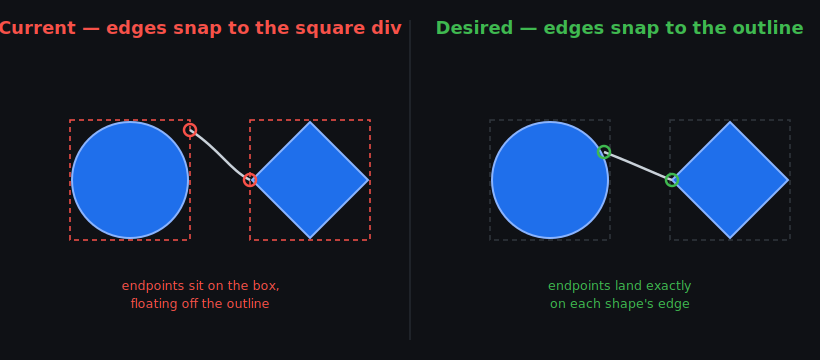
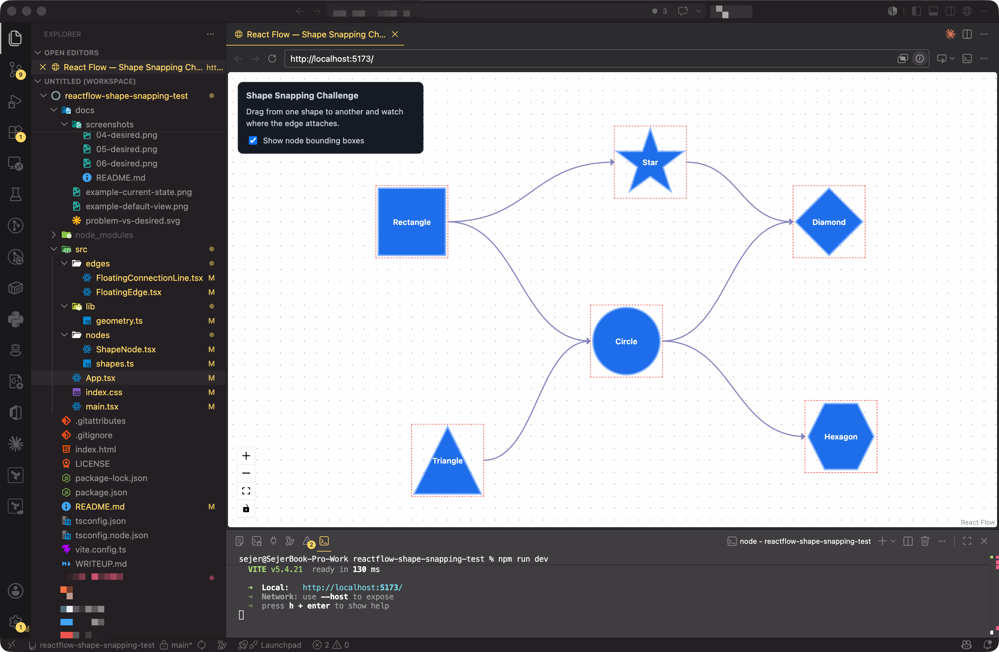
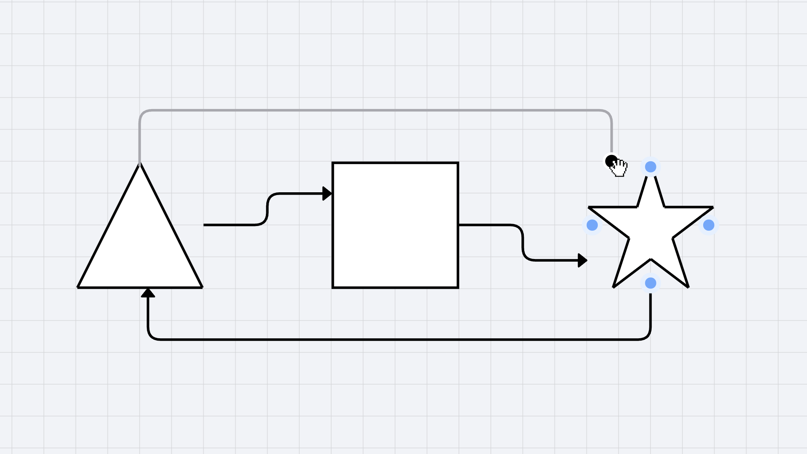
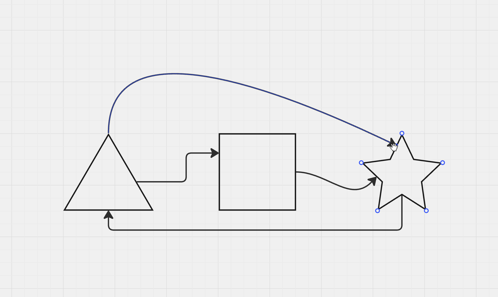
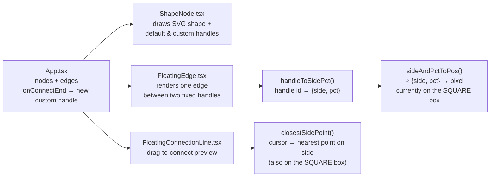

# Full-Stack Take-Home: React Flow Shape Snapping

> **TL;DR:** In a React Flow canvas you can drop an edge anywhere on a node's side and it pins there for good. But the pinned point is computed on the invisible **square** bounding box, so for anything that isn't a rectangle the edge floats off the **drawn shape**. Make those fixed connection points sit on the shape's outline, and make the connection endpoint easy to grab even when it sits on top of a node.



---

## What this is

A small, focused engineering exercise. We use [React Flow](https://reactflow.dev) to let users build diagrams out of nodes in many different shapes (rectangles, circles, diamonds, triangles, hexagons, stars, and so on). When two nodes are connected, the edge should touch the **edge of the shape**. Today it touches the edge of the shape's bounding `<div>`, which is always a square, so for anything that isn't a rectangle the connection point floats out in empty space.

### How connections work here (read this first)

This mirrors how our production app behaves, so it's worth understanding before you start:

- Every node always has **four default handles**, one at the centre of each side (`top`, `right`, `bottom`, `left`).
- You can also **drop a connection anywhere on a side**, not just on a default handle. When you do, a **custom handle is created at that exact point** and the edge attaches to it. (See `onConnectEnd` in `App.tsx`.)
- A connection point is stored as a **fixed `{ side, percentage }`** on the node. It does **not** float or re-route as nodes move. Drop an edge at "top, 10% from the left" and it stays there for good, exactly like a handle had always been there.

So this is **not** a floating-edge exercise. The endpoints are fixed. The only thing wrong is the _geometry_ that converts a stored `{ side, percentage }` into a pixel: it uses the square box instead of the drawn outline.

A common workaround you'll find online is to drop React Flow and draw everything on an HTML `<canvas>`. **That is not an option here.** The surrounding product is built deeply on React Flow, so the fix has to live inside it.

This repo is a minimal reproduction with the bug already wired up. Your job is to fix it.

> ⏱️ **Expected effort:** about 2 to 4 focused hours. It's fine to stop early; see [What to submit](#what-to-submit). We're hiring for judgement, not for who can grind the longest.
>
> 🤖 **AI tools are explicitly allowed and encouraged.** Use Claude, Cursor, Copilot, whatever you like. In the interview we'll ask you to walk us through _how_ you solved it (or what blocked you), so make sure you understand your own solution.

---

## Quick start

**Requirements:** Node 18+ and npm.

```bash
git clone <this-repo-url>
cd reactflow-shape-snapping-test
npm install
npm run dev
```

Then open the URL Vite prints (usually <http://localhost:5173>).

Useful scripts:

| Command             | What it does                                  |
| ------------------- | --------------------------------------------- |
| `npm run dev`       | Start the dev server with hot reload          |
| `npm run typecheck` | Type-check the project (`tsc --noEmit`)       |
| `npm run build`     | Type-check **and** produce a production build |

### Pinned versions (please keep these; they mirror our production app)

| Package               | Version                                                                |
| --------------------- | ---------------------------------------------------------------------- |
| `react` / `react-dom` | `^18.2.0`                                                              |
| `reactflow`           | `^11.10.1` _(the v11 line; resolves to 11.11.x, see the gotcha below)_ |
| `typescript`          | `^5.9.3`                                                               |

> The starter uses **Vite** for a fast dev loop. Our production app bundles with Webpack, but that makes no difference to this exercise. The code you write is identical either way.

---

## What you'll see

On first load you get several differently-shaped nodes joined by edges. Tick **"Show node bounding boxes"** in the top-left panel to reveal the square `<div>` behind each shape. That makes the problem obvious:



Notice how every edge lands on the **red dashed square**, not on the diamond, hexagon, triangle, circle or star. That's the bug. Try it yourself: drag from one shape to another and drop **anywhere on a side**. The edge pins to that spot (good) but the spot sits on the square box, not the outline (the bug).

> | Current behaviour                          | Desired behaviour                          |
> | ------------------------------------------ | ------------------------------------------ |
> |  |  |

---

## The challenges

### 🟥 Challenge 1: Snap the fixed connection points to the shape's outline

Each edge endpoint is a fixed `{ side, percentage }` on its node. The geometry that turns that into a pixel currently lands on the **square bounding box**. Make it land on the **drawn outline of the shape** instead. This must hold:

- for **all** shape kinds (rectangle, circle, diamond, triangle, hexagon, star);
- at **any percentage** along a side, not just the centre (you can drop a connection anywhere);
- at **any node size**: our real nodes are resizable, so the maths must use each node's _live measured_ dimensions, not hardcoded constants;
- while a node is being **dragged around** (the endpoint tracks the outline live);
- while you are **dragging out a new connection** (the in-progress preview line should also meet the outline).

Our best guess at where the fix goes is **`sideAndPctToPos()`** in `src/lib/geometry.ts` (it's marked with a comment block), with the live drag preview in **`closestSidePoint()`** in the same file. But treat that as a hint, not a spec. If you find a cleaner approach, or decide the real fix belongs somewhere else entirely, you're right and we'd love to hear the reasoning. We're pointing you at a starting line, not boxing you in. The shape kind for any node is at `node.data.shape`, and the SVG geometry for each shape is in `src/nodes/shapes.ts`.

**Acceptance check:** turn on "Show node bounding boxes" and connect shapes at odd points and angles. Every endpoint should touch the blue shape, never the red square. It should also stay put when you drag the nodes.

### 🟦 Challenge 2: Make the endpoint grabbable and on top

> ⚠️ **Challenge 1 is a prerequisite for Challenge 2.** This problem only appears _once endpoints actually sit on the shape outline_. While the bug is unfixed, endpoints float out on the square bounding box, in empty space beyond the drawn shape, where nothing occludes them and they're already easy to grab. As soon as you solve Challenge 1 and the endpoint moves _onto_ the shape (which is drawn on top, in the node layer), it gets covered by the node and becomes awkward to grab. So fix Challenge 1 first; Challenge 2 is what you'll notice next.

React Flow already supports re-dragging an edge end to a new spot (edge "reconnection"). It's wired up here, so try grabbing the end of an edge and dropping it on another shape. The problem: the endpoint and its drag-anchor render in the **edge layer, which sits _below_ the nodes**. Once the endpoint sits on the shape (post-Challenge-1), the node draws over it, so the anchor is partly covered and awkward to grab.

Make the **active / hovered edge and its reconnect anchor render above the nodes**, so a user can always grab an endpoint and move it to another point on a shape, without permanently drawing every edge over the top of everything else.

**Acceptance check:** with Challenge 1 solved, hover an edge whose endpoint sits on a shape, grab the end, and drag it to a different point on another shape. The anchor should be easy to grab and clearly visible the whole time.

---

## Where the relevant code lives

You should only need to touch a handful of files. We think most of the work for Challenge 1 lands in the geometry, but that's our read, not a rule.

```
src/
├─ App.tsx                       ReactFlow setup, nodes, edges, connect + reconnect wiring
│                                (onConnectEnd creates a custom handle on drop)
├─ lib/
│  └─ geometry.ts                ⭐ likely home of Challenge 1 (sideAndPctToPos / closestSidePoint)
├─ nodes/
│  ├─ ShapeNode.tsx              Draws the SVG shape + the default and custom handles
│  └─ shapes.ts                  Shape definitions + handle types (add more shapes here)
└─ edges/
   ├─ FloatingEdge.tsx           Custom edge: renders between two fixed handles
   └─ FloatingConnectionLine.tsx The drag-to-connect preview line
```

> ℹ️ The edge files are still named `Floating*` for historical reasons, but the edges are **not** floating. Each endpoint is pinned to a fixed handle, so don't let the name mislead you.

How the pieces fit together:



---

## Rules & constraints

- ✅ Stay inside **React Flow 11**. No swapping to a `<canvas>` renderer, and no migrating the project to React Flow 12 / `@xyflow/react`.
- ✅ Keep it **TypeScript** and keep `npm run typecheck` passing.
- ✅ You may add small helper libraries if they genuinely help, but a from-scratch solution is completely fine and arguably cleaner.
- ✅ You may change how shapes are defined/rendered if it helps your approach (e.g. exposing each shape's geometry). Just keep the visual shapes.
- 🤖 AI assistants are allowed. Understanding your solution is the only hard requirement.

---

## What to submit

1. Your code (a branch or a zip, whatever we agreed on).
2. A short **`WRITEUP.md`** (a template is already in the repo). Tell us how you solved each challenge, or, if you didn't finish, **what you tried and what blocked you**. A thoughtful "here's where I got stuck and why" is worth a lot to us.

Partial solutions are welcome. If you only crack Challenge 1, submit that.

---

## How we'll evaluate

| Area                   | What we're looking for                                                          |
| ---------------------- | ------------------------------------------------------------------------------- |
| **Correctness**        | Endpoints actually sit on the outline, at any percentage, live while dragging.  |
| **Generality**         | Works for every shape, and ideally it's obvious how to add a new one.           |
| **React Flow fluency** | Right use of nodes/edges/handles, store access, custom edges, z-index/layering. |
| **Code quality**       | Readable, typed, no dead complexity.                                            |
| **Communication**      | Your write-up and how you explain trade-offs in the interview.                  |

---

## Gotchas worth knowing

- **Fixed handles, not floating edges.** Endpoints are pinned to a stored `{ side, percentage }`; they don't re-route as nodes move. The bug is purely the box-vs-outline geometry, not the routing.
- **v11.11 reconnection API.** `^11.10.1` resolves to the **11.11** line, which renamed edge-reconnection from `onEdgeUpdate` / `updateEdge` to **`onReconnect` / `reconnectEdge`** (and deprecated the old names). This project uses the new names. A lot of older docs and AI answers still show `onEdgeUpdate`; don't reintroduce it. The package import is `reactflow`, not `@xyflow/react`.
- **Measured dimensions.** A node's real size/position lives on its _internal_ representation (`width`, `height`, `positionAbsolute`), available via the React Flow store. See how `FloatingEdge.tsx` reads it. A node may not be measured on the very first render; handle that.
- **Custom handles must exist in the DOM.** An edge can only render to a handle that's actually mounted. New custom handles are added to `node.data.handles` and rendered by `ShapeNode.tsx`, which calls `useUpdateNodeInternals` so React Flow re-measures them.
- **`ConnectionMode.Loose`** is on, so every handle can act as both source and target. `connectionRadius` controls how close to a default handle a drop must be to _reuse_ it; drop further away on a side and `onConnectEnd` creates a new custom handle at that exact point. So you can test connections from any direction, at any point on the target's outline.
- For Challenge 2, look at how React Flow decides edge stacking order (hint: edges can be lifted above nodes).

Good luck, and have fun with the maths. 🙂
